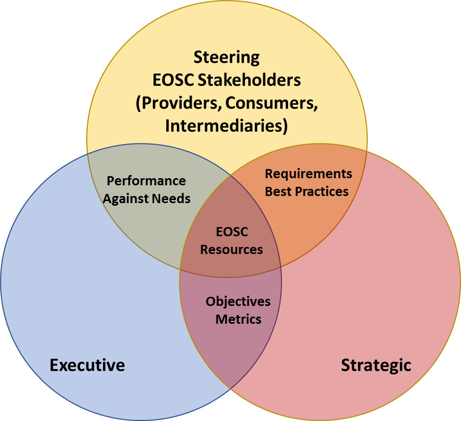

EOSC Governance Model
---------------------

## Community Lead Governance

The governance model should allow the engagement of all stakeholders, in all stakeholder roles, such that they are peers in the decision making for EOSC. For this, EOSC can borrow from Community Governance in the public sector as typically used for local government or social community initiatives. In this context, Community governance refers to the processes for making all the decisions and plans that affect life in the community, whether made by public or private organisations or by citizens. To be effective, it considers three core community skills of engaging citizens, measuring results, and getting things done in order to help people and organisations make decisions about what actions to take in a community and to measure their impact and effectiveness.  The interaction between these “skills” is shown in Figure 4. 

 

These map very closely to the layers defined in the EOSC Declaration, of Institutional, Executive, and Advisory). In this model, the Advisory Layer from the declaration would involve the engaging citizens skills to determine the scientific and technical needs of the users. The term “Advisory” is meant, in this context, to concern engaging with all stakeholders. It is important that stakeholders are, and feel that they are, peers in the decision-making process. They should perform a role that is both advisory and steering. For this reason, we have used the word “steering” in this document rather than just “advisory”.  It should be noted that there are a wide variety of definitions of “Steering Board” and “Steering Committee” from being the final decision maker or arbitrator to providing strong guidance and direction. As regards the governance framework, the definition of the Steering layer is closer to the latter – it provides strong guidance and direction (not just advisory) to the Strategic layer, but the Strategic layer is the final decision-making body.  

The declaration’s Institutional layer would define the strategic objectives and measure the impact and effectiveness of EOSC against these objectives and so would principally map to the Measuring Results skill. 

Finally, the Executive\Operational layer would map to the Getting Things Done skill by ensuring that the EOSC delivers to meet the needs of the stakeholders through the strategic objectives set by the Institutional layer. These layers are illustrated in Figure 5.

The intersections of these skills and layers are important in delivering an effective governance structure for EOSC. The Steering layer determines within its communities best practice, standards, principles of engagement, in effect addressing the recommendations of “Guidance only where guidance is due” and “Define Principles of Engagement5 for service provision in the EOSC” from the HLEG group report (Section 2.2), as well as the scientific and technical requirements of the EOSC. This forms a discussion and interaction with the Strategic layer, articulates the strategic objectives for the EOSC, and the metrics to measure how well the EOSC delivers against these objectives. This leads to an interaction between the Strategic and Executive layers to determine how the EOSC is provisioned and commissioned to meet these objectives. Finally, there is be a feedback loop between the Steering and Executive on how well the EOSC is meeting the communities’ needs, standards and practices, and a report back from the Executive to the Strategic layer on how effective the EOSC is meeting the strategy, and how effective the strategic goals are at capturing the real needs of the communities. This is outlined in Figure 6.

 

## Governance Decision Flow

The Steering layer would allow the stakeholders to determine the requirements, policies and principles of engagement, and make proposals on how these could be met to the Strategic Layer. The Strategic layer would review, agree and prioritise these proposals and requirements to form the strategic vision and objectives of the EOSC. The Executive layer would be responsible for ensuring that the EOSC meets this vision and these objectives by: commissioning Core resource as required; commissioning new Supported resources as required; ensuring that Supported services are properly compensated; and ensuring that the resources within EOSC are both compliant and meet the strategic objectives. Annex A outlines some delivery models for how the Executive layer might commission and support the Core and Supported resources. The Steering layer would also communicate to the Executive at how well the EOSC is meeting their requirements at an operational level, and the Executive would report this against the strategic objective to the Strategic layer.

 
For example, a scientific discipline (or disciplines) within the Steering layer might define data interoperability and re-use principles for data within their domains. The Strategic layer would translate this into strategic objectives and requirements for resource within EOSC which handle such data. The Executive would have responsibility for ensuring such resources existed within EOSC, and would receive input from the Steering layer on how well these resources are in enabling data interoperability and re-use. Alternatively, communities within the Steering layer might identify key areas where training and support are required, the Strategic layer would again translate these to objectives, the Executive would ensure that there were resources within EOSC to meet these training and support requirements, and the Steering would report how effective they are.
